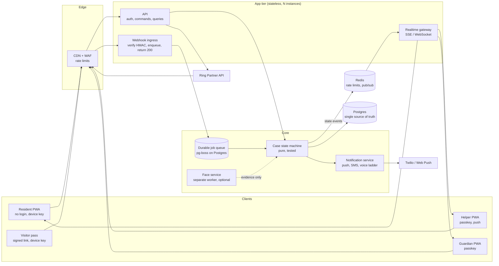
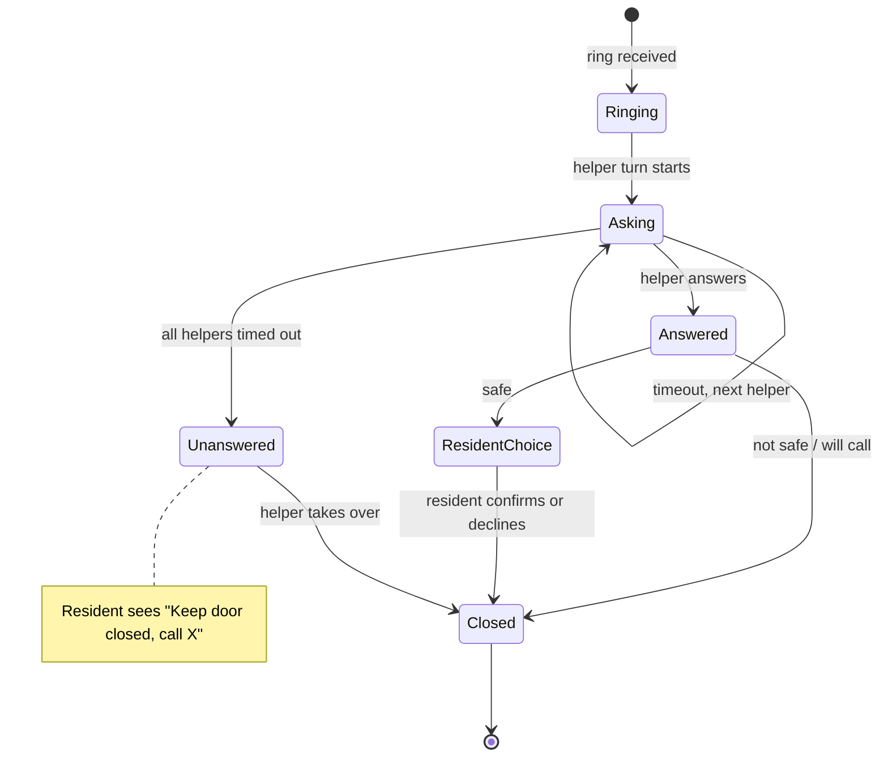
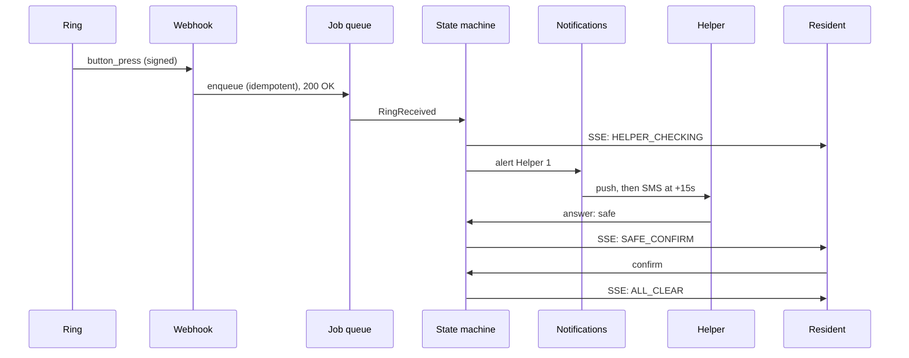

# Doorbell Helper v2: Simpler Architecture

**Problem today:** too many separate secrets for people to type: login OTP, 6-digit pairing code, invite code, visitor pass-word, rotating 3-digit code, device-bound status links. Each one was added to fix one risk, and together they make a confusing product for the people who need it most.

**Core idea:** *the app should ask people to prove who they are once, and then never again.* Security comes from devices and keys, not from humans typing codes. Rules of thumb borrowed from WhatsApp, Apple Home, Ring, Slack and PagerDuty:

| Pattern | Borrowed from | Replaces |
| --- | --- | --- |
| Passkeys and one-tap magic links, long-lived device sessions | Apple, Google, Linear, Slack | Login OTP every time |
| Scan a QR once to link a device | WhatsApp Web, Apple TV | 6-digit pairing code |
| One invite link, consent on the same screen | Slack, Google Calendar | Invite code and separate consent step |
| Visitor "pass" saved to phone, one tap "I'm here" | Airline boarding pass, Uber | Pass-word and rotating code |
| Notification ladder: push, then SMS, then call | PagerDuty, Opsgenie | Ad-hoc SMS fallback |
| Durable job queue for timers | Stripe, Shopify | In-memory timers |
| Server pushes state (SSE), client never guesses | Linear, Figma | Polling and stale-screen logic |

---

## 1. Human flows: before and after

| Person | Today | v2 |
| --- | --- | --- |
| **Guardian** sign-up | Enter details, OTP, link Ring, invite each helper | Create a passkey (Face ID / fingerprint). Link Ring. Add helpers by name and phone. Done. |
| **Guardian** return | New OTP each login | Open the app. Passkey signs in silently. |
| **Helper** join | Receive link, enter OTP, give consent separately, enable push | Tap the SMS link, read one consent screen, tap "I agree". A passkey is created automatically. |
| **Helper** return | OTP when session expires | Never. Session lasts 90 days and renews on use. |
| **Resident** device | Type a 6-digit pairing code | Guardian shows a QR on their phone. Resident tablet scans it once. No resident login ever. |
| **Resident** daily | Screen only | Same. Nothing to type. |
| **Visitor** (cleaner, carer) | Pass-word or a rotating code read aloud | Gets a link once, taps "Add to Home Screen". On arrival: one big "I'm here" button. |
| **One-off visitor** | Request form, guardian approves, status link bound to one device, code | Request form, guardian approves, visitor gets a pass link valid for the time window. No code. |

**Codes typed by a human: from \~6 to 0** (OTP remains only as a fallback when a passkey is unavailable).

---

## 2. How verification works without codes

The old codes tried to answer "is this really the expected visitor?". v2 answers it with stronger, easier signals, and always with a human in the loop:

1. **Visitor taps "I'm here" on their saved pass.** This is authenticated by the visitor's device key, so it can't be guessed.
2. The helper's alert says **"Priya (cleaner), arrived, expected 10:00 to 10:30"** with the live view.
3. The helper taps ✅ or ⛔. The resident then sees one plain sentence and one big button.
4. Unannounced rings are still treated as unknown visitors and get a full alert.

Optional: face match stays as **evidence only**, exactly as today.

An optional "strict mode" keeps the resident-checks-a-code step for households who want it, but it is off by default.

---

## 3. System architecture



### What changes versus today

| Concern | Today | v2 | Why |
| --- | --- | --- | --- |
| Timers | In-memory; must run **exactly one** server | Durable jobs in Postgres (`pg-boss`): "escalate case 123 at 10:00:30" | Survives restarts; allows multiple instances |
| Webhook | Does the work inline | Verify signature, write an outbox row, return 200 in under 50 ms, process async | Ring never times out; floods can't block |
| Idempotency | `request_id` dedupe in app code | Unique constraint in DB, plus idempotency keys on every command | Race-proof under concurrency |
| Resident updates | Polling plus stale detection | Server-sent events with heartbeat; no heartbeat means the screen shows "keep door closed" | Instant, and fail-closed by design |
| Rate limits | In-memory `Map`, trusts `X-Forwarded-For` | Redis at the edge, keyed by device/account, not just IP | Survives restarts; can't be spoofed |
| Auth | OTP plus JWT cookies | Passkeys (WebAuthn), magic links, rotating refresh tokens, device registry | One-time friction |
| Notifications | Push and SMS code paths in the store | Dedicated ladder: push at 0 s, SMS at +15 s, voice call at +45 s, with delivery receipts | Delivery is observable |
| Face | In-process library | Separate worker with a bounded queue | Can never slow an alert |

---

## 4. The case state machine (the heart of the app)

One pure, unit-tested function: `(state, event) -> (state, effects)`. Every screen is a projection of it.



**The "ResidentView" rule:** the server computes exactly one of six screens and sends it. The client only renders it.

`CLOSED_KEEP_SHUT` · `WAITING` · `HELPER_CHECKING` · `SAFE_CONFIRM` · `NOT_SAFE` · `ALL_CLEAR`

Priority is fixed in code: **offline / lost heartbeat > night lock > not safe > waiting > safe > all clear**. A safe answer can never beat a night lock or a lost connection. This is the single most important invariant, so it lives in one file with property-based tests.

---

## 5. Doorbell sequence



---

## 6. Data model (simplified)

```
Household      id, timezone, settings (preset: Standard | Strict | Custom)
Member         id, householdId, role (owner | helper), name, phone, order, consentedAt
Device         id, memberId?, householdId, kind (resident | helper | guardian | visitor),
               publicKey, lastSeenAt, revokedAt          -- replaces cookies + pairing codes
Passkey        id, memberId, credentialId, publicKey
Case           id, householdId, kind, state, version, deadlineAt   -- optimistic locking
CaseEvent      id, caseId, type, actorDeviceId, at, payload        -- append-only audit log
Pass           id, householdId, visitorName, window, recurrence, deviceId?, revokedAt
Job            (managed by pg-boss)
```

Key simplification: **`Device` replaces cookies, pairing codes, status links and visitor tokens.** Revoking a device kills access immediately, from one place.

---

## 7. Settings people actually see

Replace \~20 environment-driven options with three presets plus one screen:

- **Standard:** helper answers, night lock 22:00 to 06:00, 30 s per helper.
- **Strict:** every ring goes to a helper, no shortcuts, resident-code verification on.
- **Custom:** reveals timeouts, quiet hours, check-in time.

Everything else stays in code defaults.

---

## 8. Migration plan from the current codebase

You do not need a rewrite. Most of today's domain logic (case rules, face module, schema pieces, tests) is reusable.

| Phase | Work | Effort | Keeps |
| --- | --- | --- | --- |
| **1. Remove typing** | Passkeys and magic-link login; QR pairing for resident; single-screen helper invite with consent | \~1-2 weeks | Schema, roles, all case logic |
| **2. Durable timers** | Move escalation and check-in timers to `pg-boss`; webhook becomes enqueue-and-return; DB unique idempotency | \~1 week | `store.ts` rules, tests |
| **3. Realtime and fail-closed** | SSE channel with heartbeat; server-computed `ResidentView`; delete client-side stale logic | \~1 week | UI components |
| **4. Visitor passes** | Replace pass-word and rotating code with passes and "I'm here"; keep codes as optional Strict mode | \~1 week | Visit and recurring models |
| **5. Notification ladder** | Push, SMS, voice with delivery receipts; Redis rate limits at the edge | \~1 week | Twilio and VAPID setup |
| **6. Hardening** | Re-run the stress-test guide against v2; add chaos tests for killing the worker mid-case | ongoing | The test guide |

## 9. Trade-offs to be honest about

- **Passkeys** need a modern phone or browser. Magic-link login covers everything else, so nobody is locked out.
- **Removing visitor codes** removes one anti-impersonation layer. The replacement is device-bound passes plus a human helper confirming on live video, which is stronger against guessing but relies on the helper.
- **Postgres-based queues** are simpler than Kafka or Temporal and fine at this scale. Temporal would be worth it only with many thousands of households.
- **This is a design, not yet code.** Nothing in the uploaded project has been changed.